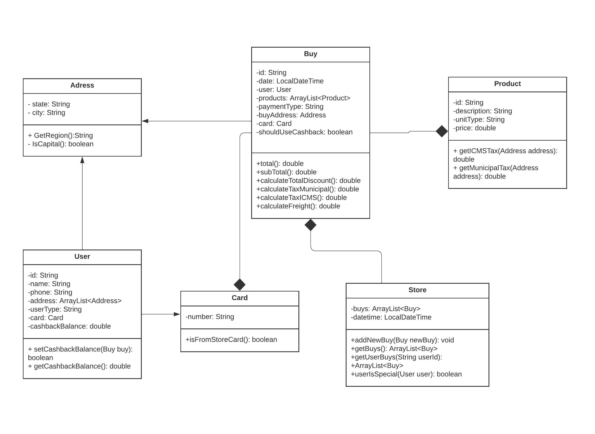

# Trabalho_1_TDD
trabalho para a materia de TPPE

## :handshake: Colaboradores

|  |  |  |  |
|:----------------------------------------------------------:|:------------------------------------------------:|:-------------------------------------------------------------:|:----------------------------------------------------:|
|[Paulo Henrique](https://github.com/PhRezende-eng)      | [Guilherme Barbosa](https://github.com/guibrbs)     | [Silas Neres](https://github.com/Silas-neres)      | [Helder lourenco](https://github.com/TaynaraCris)      |
|190094257    | 200037994   | 200043536     | 180121847      |

## Descrição do Projeto 

O sistema foi criado utilizando a ferramenta JUnit4, com o propósito de aplicar a técnica de desenvolvimento de software TDD (Test Driven Development) e a técnica de parametrização de testes. A aplicação simula um sistema de vendas, permitindo o gerenciamento de clientes, produtos e a realização de vendas, além de calcular valores como descontos, impostos e frete.

## Diagrama de classes

## Implementação
A implementação utilizando TDD proporcionou um desenvolvimento robusto e confiável, garantindo que todas as funcionalidades fossem validadas desde o início. Isso não apenas melhorou a qualidade do código, mas também facilitou a identificação e correção de erros durante o desenvolvimento. A aplicação de TDD assegurou que cada componente do sistema fosse devidamente testado, resultando em um software mais estável e fácil de manter.

## Ferramentas Utilizadas

- JUnit4: Ferramenta de testes unitários para Java, utilizada para escrever e executar os testes.
- VScode: utilizado para o desenvolvimento do projeto.
- Git/GitHub: Controle de versão e hospedagem do código-fonte.

